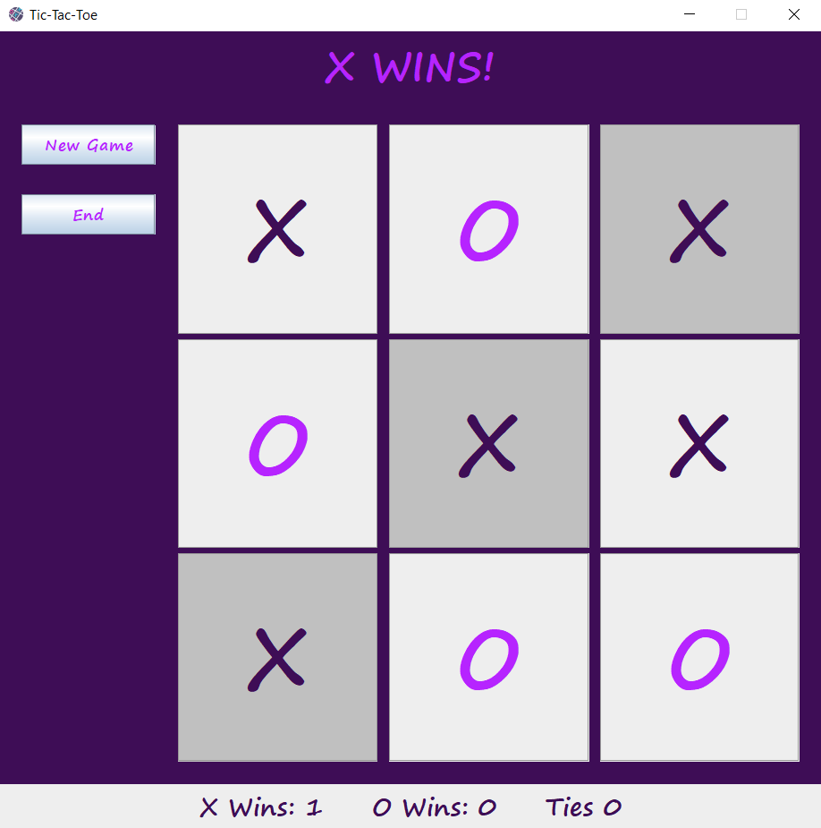

# tic-tac-toe
Tic-Tac-Toe game

<!-- TABLE OF CONTENTS -->

  
Table of Contents

  <ol>
    <li><a href="#about-the-project">About The Project</a></li>
    <li><a href="#license">License</a></li>
    <li><a href="#contact">Contact</a></li>
    <li><a href="#acknowledgments">Acknowledgments</a></li>
  </ol>

<!-- ABOUT THE PROJECT -->
## About The Project

This java project is a classic game of Tic-Tac-Toe.  

### Features
* Shows player's turn at the top of the frame
* After a game is complete, easily start a new game with just a click
* Tracks number of wins and ties at the bottom
* Allows players to clear a game
* Shows which cells caused the win

(<a href="#readme-top">back to top</a>)

### Built With

* Intellij IDEA
* Swing
* GUI Form

(<a href="#readme-top">back to top</a>)

<!-- LICENSE -->
## License

Distributed under the MIT License. See `LICENSE.txt` for more information.

(<a href="#readme-top">back to top</a>)

<!-- CONTACT -->
## Contact

Project Link: https://github.com/hparker13/tic-tac-toe

(<a href="#readme-top">back to top</a>)

<!-- ACKNOWLEDGMENTS -->
## Acknowledgments

We can get by with a little help from our friends...

* icon from <a href="https://www.flaticon.com/free-icons/tic-tac-toe" title="tic tac toe icons">Tic tac toe icons created by Freepik - Flaticon</a>

(<a href="#readme-top">back to top</a>)

